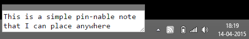

# One Thing

*What am I doing?*

Every time I get distracted, I have to ask myself this question. It takes a
few seconds to figure out, and this is further hindered by the numbers windows
and tabs that I have open.

What I need is a stick-it note where I can write what I was doing before I got
interrupted. When I'm done, I'll look at it and get back to the **one thing**
that I should be doing.

This means that the note should be

- Always on top
- Small
- Moveable

This is a classic application of OneNote's quick notes or Evernote's pin
notes. But I don't like to install new software, I like writing my own.

This is a [Chrome application](https://developer.chrome.com/apps/about_apps)
that behaves like a native application. I took the
[frameless window](https://github.com/GoogleChrome/chrome-app-samples/tree/master/samples/frameless-window)
and stripped it to a bare minimum.

To run it the first time:

- Go to **chrome://flags** and enable "Experimental Extension APIs". Restart
  Chrome
- Go to **chrome://extensions/**, enable "Developer mode", select "Load
  unpacked extension..." and select this folder.
- Launch the app and note the value against the **ID**

Thereafter:

- Create a desktop shortcut pointing to Chrome with the argument
  `--app-id=...` -- replace the `...` with the ID you noted
